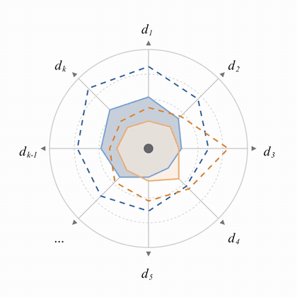
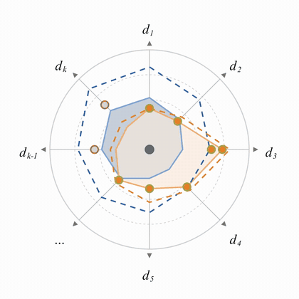
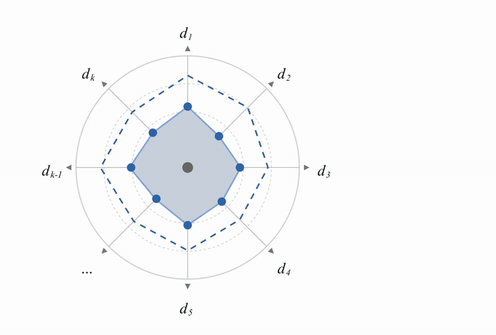
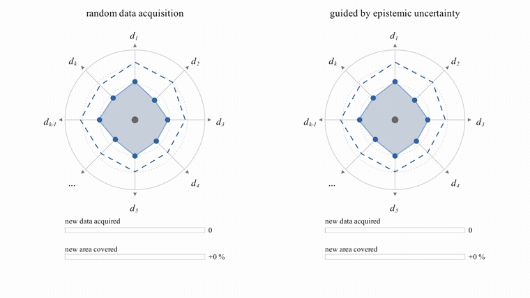
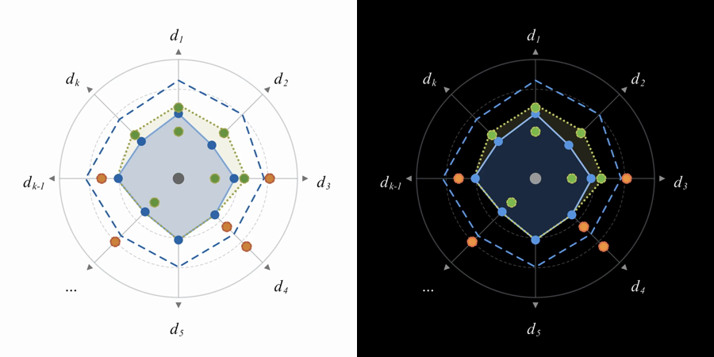

# Is This Progress? — animated Figure 1

Animated versions of Figure 1 from the perspective
**“Is This Progress? On the utility of predictive systems for scientific discovery.”**

Figure 1 sketches predictive systems as radar plots over (illustrative) knowledge
dimensions *d₁ … d_k*. For each system, a **solid outline** marks what it has learned
from data so far, and a **dashed outline** marks the most it could ever reach — its
capacity bound, set by its inductive commitment. These four short movies make the
ideas in the figure move, for use in talks.

All geometry, colours, and line weights are taken directly from the original
Illustrator figure (`source.ai`), so the movies match the paper.

**Just want the videos?** Ready-made 1080p MP4s of all four movies, for white and
for black slides, are attached to the
[latest release](https://github.com/fjug/AI4Science_CapacityBoundsAndData/releases/latest).

## The movies

### 1 · Data expands reach — `data_expands_reach` (10 s)



Based on Fig. 1(a). New observations arrive one at a time and the orange system’s
learned region grows toward its capacity bound — close to it, touching it in
places, but never beyond it.

Some observations fall *outside* the dashed bound (red ring, grey fill). The
system cannot make sense of them, so its outline barely moves.

<br clear="right">

### 2 · Not all data is for everyone — `not_all_data_is_for_everyone` (8 s)



Picks up exactly where movie 1 ends. The observations the orange system could not
use are taken up by a second, complementary system (blue) — for example a human
next to an agentic LLM system. More data arrives in a region only the blue system
can learn from; the orange outline stays where it is.

The last observation (half blue, half orange) lies within reach of both systems,
and both outlines grow to meet it.

<br clear="right">

### 3 · What can be predicted — `what_can_be_predicted` (24 s)



Based on Fig. 1(d, e). This movie is about prediction, not learning. Query points
(hollow, dashed rings) are posed to the blue system and turn green when predicted
correctly and orange when not:

1. **Interpolation** inside the learned region works.
2. **Extrapolation** beyond the learned region works too — in places.
3. Queries outside the capacity bound are **strictly unpredictable**.
4. But some queries *inside* the capacity bound fail as well …
5. … because they lie outside the **extrapolation reach** (dotted line), which is
   revealed at the end and is narrower than the capacity bound.

Short captions fade in and out at each step.

### 4 · Uncertainty-guided acquisition — `uncertainty_guided_acquisition` (23 s)



Data is expensive. Two identical copies of the blue system from Fig. 1(d, e) learn
side by side; below each, bars track **new data acquired** and **new area covered**.

- **Left — random data acquisition.** 20 observations arrive at random. Most land
  inside the area already learned and are redundant (grey with olive ring, as in
  Fig. 1(c)); only a few expand the outline.
- **Right — guided by epistemic uncertainty.** The system is queried all over its
  plot; each query is coloured by its epistemic uncertainty, from green (low) to
  red (high). An experiment is run only where the system is most unsure, and the
  new observation expands the outline. After just 5 such experiments, the learned
  area has grown as much — and into the same shape — as with 20 random ones.

The message: guiding expensive data acquisition by epistemic uncertainty gets you to
a better predictive system with far less effort.

## Colour themes



Every movie is rendered in two colour schemes from the same code:

| Theme | Use it for | Colours |
|---|---|---|
| `light` | white slides, the web | exactly the paper’s figure |
| `dark` | black slides | same hues, brightened to read on black; fills become dark tints |

All colours live in [`themes.py`](themes.py). To add a scheme (e.g. for a different
slide template), copy one of the entries under a new name — the render script
picks it up automatically.

## Installation

You need [uv](https://docs.astral.sh/uv/) (it installs the right Python and all
dependencies for you):

```bash
curl -LsSf https://astral.sh/uv/install.sh | sh
```

Then, in this folder:

```bash
uv sync
```

**Fonts.** Labels and captions use *Times New Roman*, which ships with macOS and
Windows. On Linux, install it first (e.g. `sudo apt install ttf-mscorefonts-installer`).

**Linux only.** [Manim](https://www.manim.community/) needs Cairo and Pango
(`sudo apt install libcairo2-dev libpango1.0-dev pkg-config`). On macOS and Windows
everything comes with the Python packages.

## Rendering

Render all movies in all themes (1080p, about 15 s on a laptop):

```bash
uv run python render_all.py
```

The finished movies land in `movies/<theme>/<movie>.mp4`. Some variants:

```bash
uv run python render_all.py dark        # one theme only
uv run python render_all.py -q l        # quick 480p drafts
uv run python render_all.py -q k        # 4K
```

To render and immediately watch a single movie while working on it:

```bash
THEME=dark uv run manim -ql -p what_can_be_predicted.py WhatCanBePredicted
```

## Changing the story

| What | Where |
|---|---|
| Data points of movie 1 (where, in which order) | `DATA_B` in [`radar.py`](radar.py) |
| Data points of movie 2 | `DATA_A` and `SHARED` in [`not_all_data_is_for_everyone.py`](not_all_data_is_for_everyone.py) |
| Query points, captions, and timing of movie 3 | [`what_can_be_predicted.py`](what_can_be_predicted.py) |
| Number of random points and guided rounds, uncertainty model, layout of movie 4 | top of [`uncertainty_guided_acquisition.py`](uncertainty_guided_acquisition.py) |
| Colours | [`themes.py`](themes.py) |

Points are given as `(axis, radius)`: axis `0` is *d₁* at the top, counting
clockwise up to `7` (*d_k*), and the radius is in the figure’s units (points in
`source.ai`; the outer circle is 145).

Movie 4 draws its data at random, from two fixed seeds chosen so that both sides
end with the same gain in area and nearly the same shape. If you change its
settings, find a new matching pair with:

```bash
uv run python uncertainty_guided_acquisition.py
```

## Project layout

```
radar.py                          shared drawing code: radar (any size/position), outlines, data points
data_expands_reach.py             movie 1
not_all_data_is_for_everyone.py   movie 2
what_can_be_predicted.py          movie 3
uncertainty_guided_acquisition.py movie 4
themes.py                         colour schemes
render_all.py                     renders every movie in every theme
source.ai                         original Figure 1 (Illustrator, PDF-compatible)
docs/                             previews used in this README
LICENSE                           MIT license
```

## Citation

If you use these animations, please cite the paper:

```
<citation to be added>
```

## License

[MIT](LICENSE) © 2026 Florian Jug
